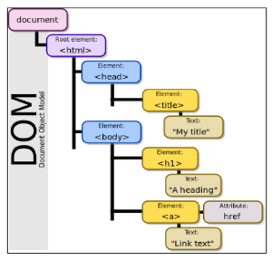
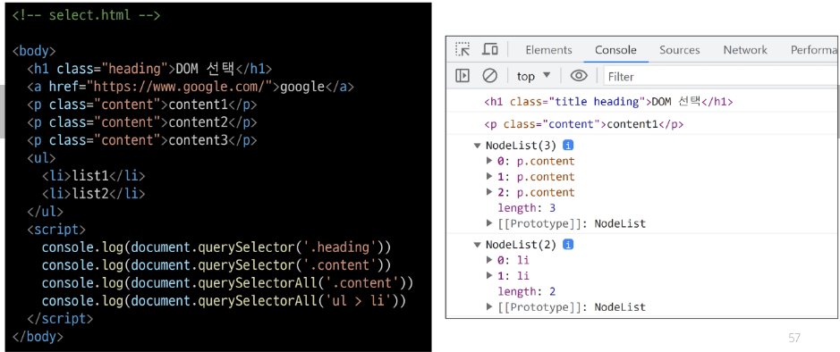

## JS:Javascript_변수 선언, DOM
자바스크립트 Day01
***
### 웹과 JS의 역사
웹의 탄생 -> Nestcape Navigator의 웹브라우저 -> 동적 기능 제공 Javascript  
-> 브라우저 전쟁 : MS -> ECMAscript의 표준언어 -> 2차 브라우저 전쟁 : Chrome

### ECMAscript
표준화된 스크립트 프로그래밍 언어 명세  
표준화의 장점 : 호환성, 개발자 도구를 지원

***
## Javascript 문법
[js 규칙 공식문서](https://standardjs.com/rules-kokr#javascript-standard-style)  
`console.log()`로 출력
## 변수
`$`, `_`로 시작
* snake case로 작성 X_상수의 경우에만 대문자로 사용
* camelCase : 변수, 객체, 함수에 사용
* PascalCase : 클래스, 생성자에 사용

### 변수 선언 키워드
### `let` : 재할당이 필요한 경우
* block scope를 갖는 지역변수 
* **재할당 가능**  
    ```javascript
    let number = 10 # 선언 및 초기값 할당  
    number = 20 # 재할당
    ```
* 재선언 불가능  
    ```javascript
    let number = 10 # 선언 및 초기값 할당  
    let number = 20 # 재선언 불가능
    ```
### `const` : 기본적으로 사용하는 선언 방식
* block scope를 갖는 지역변수 
* **재할당 불가능**  
    ```javascript
    const number = 10 # 선언 및 초기값 할당  
    number = 20 # 재할당 불가능
    ```
* 재선언 불가능  
    ```javascript
    const number = 10 # 선언 및 초기값 할당  
    const number = 20 # 재선언 불가능
    ```

### block scope
if, for 함수 내의 { }영역, 중괄호 내부  
블록 스코프를 가지는 변수는 블록 바깥에서 접근 불가능
```javascript
<script>
let x = 1

if (x === 1) {
    let x = 2
    console.log(x)  // 2        # 출력
}
```
***
## DOM  Document Object Model 문서 객체 모델
웹페이지(Documet)를 구조화된 객체로 제공  
-> 프로그래밍 언어가 페이지 구조에 접근(문서 구조, 스타일, 내용 변경)할 수 있는 방법 제공  
: 웹브라우저의 동적인 기능 구현 가능  

### DOM API
페이지의 요소를 객체 형태로 제공 -> 메소드로 접근 가능  
document 객체_트리 형태로 이루어져 객체 간 상속 구조 존재     


#### `Document` 객체
- 웹 페이지 객체
- DOM Tree 진입점
- 페이지를 구성하는 모든 구성 요소를 포함하는 객체  
- `document.title = '제목 명'`으로 탭에 드러나는 title 변경 가능

#### 선택과 조작
* 변경하고자 하는 요소 **선택**  
`document.querySelector(요소 명)` 요소 한 개 선택, 없다면 null
`document.querySelectorAll()` 요소 여러개 선택, Nodelist 반환


* 해당 요소의 속성, 내용 **조작**
   1. 속성 조작
       * 클래스 속성   
        : `clssList` property = 요소의 클래스 목록을 DOMTokenList(유사배열)형태로 반환   
        `element.classList.add()` | `.remove()` | `.toggle()` 있으면 제거 후 false, 없으면 추가 후 true 반환  
        ex) `h1Tag.classList.add('red')`
       * 일반 속성  
        : `Element.getAttribute()` : 해당요소에 지정된 값 반환  
        `Element.setAttribute(name, value)`: 지정된 요소의 속성 값 설정, 갱신    
        `Element.removeAttribute()`: 해당 속성 제거    
        ex) 
            ```javascript
            const aTag = document.querySelector('a')
            console.log(aTag.getAttribute('href'))

            aTag.setAttribute('href', 'https://www.naver.com/')
            console.log(aTag.getAttribute('href'))
            ```
   2. HTML 콘텐츠 조작  
    `요소 명.textContent = '변경하고자 하는 내용 '`
   3. DOM 요소 조작  
    `document.createElement(tagName)` : 작성한 tagName의 HTML 요소 생성 후 반환  
    `Node.appendChild()` : 해당 부모의 자식 Nodelist 중 마지막에 추가 후 해당 Node 반환    
    `Node.removeChild()` : 자식노드 제거 후 반환  
   4. 스타일 조작    
    `Node.style.속성명 = '속성 값'` : 으로 css에 해당하는 style 값 변경  

***
### 참고_DOM의 구성요소, Var와 호이스팅
* DOM 속성 확인  
  : 개발자도구 - Elements - Properties에서 선택한 요소의 속성 값 확인 가능
* Node
  * DOM의 기본 구성 단위
  * DOM의 각 부분은 Node라는 객체로 표현  
    1. Document Node = HTML 문서 전체를 나타내는 노드  
    2. Elment Node = HTML 요소를 나타내는 노드(ex) `<p>`    
    3. Text Node = HTML 텍스트  
    4. Attribute Node = HTML 요소의 속성
* NodeList  
  Node의 목록이 NodeList = index로 접근 가능(배열)  
* element  
  Node이고 노드의 하위 유형에 해당, 추가적으로 요소특화된 기능을 가짐  
* Parsing  
  브라우저가 문자열을 해석해 DOM Tree로 만드는 과정
* `;` 세미콜론  
  ASI로 자동으로 세미콜론을 삽입해줌 -> 선택적으로 작성 o, x 가능
* var  
  : 과거에 사용되었던 변수 선언 키워드  
  재할당, 재선언 가능하지만 선언하기 전에 사용할 수 있는 '호이스팅'(변수 할당 전까지 undefined) 특성이 단점
***