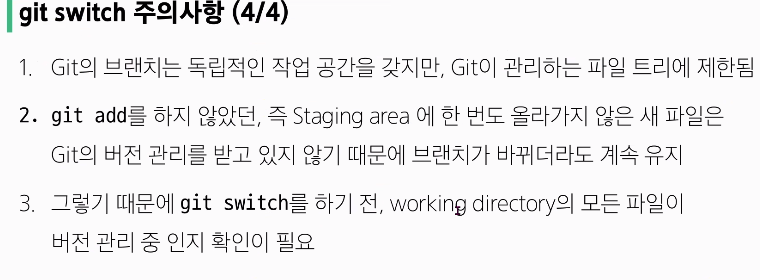
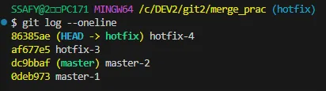
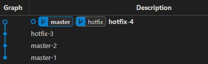
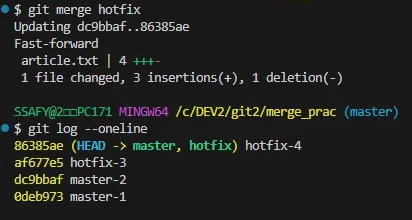

### 07.10 01일차
# GIT
***분산* 버전 관리 시스템**  *by. 리누안*  
*cf)SVN 중앙집중식 버전관리: 서버에만 저장되는 히스토리, 버전 정보*  
- github vs git는 chatgpt와 gpt같은 느낌  
git은 sw프로그램  

## 동작
### 1. **Working Directory**   
: 파일이 위치하는 폴더   
*`by. git init`으로 생성*, *`by. git status`으로 상태확인*  

### 2. **Staging Area**   
   : 변경된 파일 중에서 다음버전으로 선택적으로 추가, 제거 할 것   
   *`by. git add 파일명`: 임시저장//`git add .`디렉토리의 모든 내용 임시저장*  

### 3. **Repository**   
   : 버전= commit(저장) 이력, 파일이 영구적으로 저장되는 영역  
   *`by. git commit`저장, 배포*  

    
- 작성자 정보 git config   
cf)`git config --global user.email "이메일@.com 주소"`  
`git config --global user.name 이름` 으로 초기 설정0  

- cf)untracked files는 staging area에서 관리한 적이 없음  
modified는 git에서 commit 하여 관리한 적이 있는것_추적 중  
특정 작업만 add해서 staging area에 올리고 commit하기도 가능  

### **README.md**   
: 특정 파일, API, 레파지토리 등을 소개하는 대문  
 *마크다운 맞춰서 작성*

***  
### 07.11 02일차
*01차 수업 복습*
- `git init`  
**working directory**로 만들기  
로컬 저장소 설정_초기화: reset이 아니라 sw적으로 초기 값을 설정하여 세팅하는 것  
~~git 로컬 저장소에 또다시 git 로컬 저장소 만들기 금지_바깥쪽에서 추적 불가능~~
- `git status`  
**working directory** 상태 확인

- `git add` . = all / 특정 파일도 가능  
**staging area** 변경사항을 임시 저장  
- `git restore --staged 파일이름...`   
**staging area** 에서 변경사항 있던 파일 내려버리기  

- `git commit -m '메세지 내용' `//+`--amend`   
  : 커밋 메시지 또는 누락된 내용(staging area에 있는 파일) 수정  
**repository**에 버전 저장  
- `git log` + `--oneline`  
**repository**에 버전 저장한 내역 확인 + 간단히 보기  

## 저장장소 Remote와 local
- **Remote Repository**  
  : 원격 저장소, git hub, 온라인 상의 특정 위치에 버전 관리 이력 저장  
*->이걸 내 컴퓨터에 가져오게 되면 remote repository를 local repository로 사용하는 것*  
    - `git remote` + 명령어 : 원격 저장소에 무언가를 하겠다  
    ex) `git remote add origin remote_repo_url`  
    *원격 저장소에 add 할거야, origin이라는 이름으로, url이 위치한 장소에*  

  ## **push 버전 업데이트 & pull 버전 동기화, clone 다운로드**
  - `git push origin master`   
  : origin이라는 이름을 가진 url(remote repository)에  
  master라는 브랜치로 commit 버전 목록(=로컬 레파지토리 내용) 업로드하기
  - `git pull origin master`   
  : 원격저장소의 변경사항 저장해 옴
  - `git clone +url`: 원격저장소 내용 다운로드_~~git init 불필요~~
  - *`.gitignore` 버전관리시 무시해야될 파일, 레파지토리 초기생성시 지정*

## Git Branch
- 독립된 개발 환경 형성
- 하나의 작업 → 하나의 브랜치 : 기능 업데이트, 협업 개발 가능
- **master**에 영향을 주지 않는 브랜치의 에러
    - 다른 브랜치가 파생되는 기준점
    - 에러, 기능추가 등을 완료한 후 master에 병합하여 새로운 버전의 master 생성

### git branch 브랜치 기본 명령어
1. `git branch` : 브랜치 목록 확인
2. `git branch -r` : 원격 저장소의 브랜치 목록 확인
3. `git branch <브랜치 명>`: 새로운 브랜치 생성
4. `git branch -d <브랜치 명>`  : 병합된 브랜치만 삭제 가능
5. `git branch -D <브랜치 명>` : 강제 삭제

### git switch 브랜치 이동
: 현재 브랜치에서 다른 브랜치로 HEAD 이동  

- HEAD : 현재 브랜치나 commit을 가리키는 포인터
1. `git switch <다른 브랜치 명>` : 다른 브랜치로 전환
2. `git switch -c <브랜치 명> (<commit ID>)`  : `(commit ID = 특정 커밋에서)`새로운 브랜치 생성 후 전환
    
    
    
    
    
    - 브랜치 사이의 이동 → HEAD가 특정 브랜치를 가리킴
    - 가장 최신 commit을 가리키며, working directory도 그 당시의 파일들의 상태를 가져오게 됨
    
    
    
    
    

## git merge 병합
병합의 진행 위치 확인 필수!!(수신 브랜치에서 진행)  
병합이 끝나고 나면 안쓰는 branch 삭제 필요! = **병합 완료된 branch는 삭제**

### **fast-forward Merge**
- 빨리 감기, ‘실제로’ 병합 X
- 현재 브랜치의 상태를 대상 브랜치의 상태로 포인터만 이동
    
    
    
    
    
    

### **3-way merge**

- 충돌 **conflict** 발생
    같은 파일을 수정하여, 한 파일로 합치려하니 같은 부분이 다르게 수정되어 문제 발생한 경우
    → 2중으로 수정된 부분 해결 필요
    
    

### Git feature
**Pull Request: master**에 변경사항을 적용 요청

## Fork 복사
다른 사용자의 원격 저장소를 자신의 계정으로 복사

- 원본 저장소와 연결 유지
- 변경 사항 만들 수 있음 → 독립적인 저장소

ex) 오픈소스 프로젝트 참여 
→ fork 후 branch 생성하여 수정 → 내 저장소에 push & 원본 저장소에 pull request 가능

***  
+추가적인 내용+
***
### CLI vs GUI
- **GUI**  
: graphic user interface   
사용자가 사용하기 편하게 시각적으로 구현된 인터페이스  
- **CLI**   
: command line interface  
명령어로 사용자와 컴퓨터가 상호작용  
---  
cmd창 이용해서 명령어 치는 것에 익숙해지자!
- **`touch`** 파일생성
- **`start`** 파일 열기_GUI로 열림
- **`rm`** 삭제할 때 -r 은 디렉토리 삭제를 위함
- **`mkdir`** 폴더 생성
- VIM_cmd창에서의 text editor  
**VIM 명령어**
    - ` vi + 파일명` : 내용 수정
    - ` cat + 파일명` : 내용 미리보기
    - `i`  : 작성
    - `esc` : 작성모드 취소
    - `shift :`
    - `:q`: 나가기
    - `:wq`: 저장하고 나가기
    - `:q!`: 저장 없이 나가기\  

---
- **상대경로**_현재위치 기반 파일의 위치
---
### API
: Application Programming Interface

1학기 목표_ API 만들기

두 SW가 서로 통신할 수 있게끔 하는 메커니즘

인터페이스_기능을 보여줄 수 있는 화면, 기능 등

