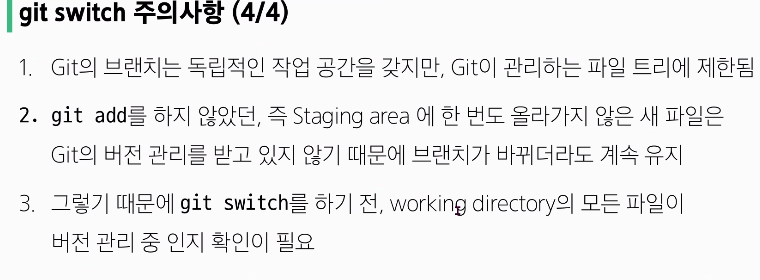
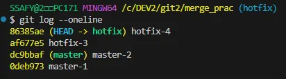
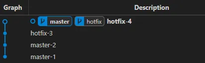
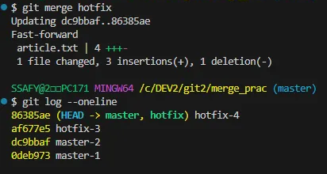

# Git

## Git Branch
- 독립된 개발 환경 형성
- 하나의 작업 → 하나의 브랜치 : 기능 업데이트, 협업 개발 가능
- **master**에 영향을 주지 않는 브랜치의 에러
    - 다른 브랜치가 파생되는 기준점
    - 에러, 기능추가 등을 완료한 후 master에 병합하여 새로운 버전의 master 생성

### git branch 브랜치 기본 명령어
1. `git branch` : 브랜치 목록 확인
2. `git branch -r` : 원격 저장소의 브랜치 목록 확인
3. `git branch <브랜치 명>`: 새로운 브랜치 생성
4. `git branch -d <브랜치 명>`  : 병합된 브랜치만 삭제 가능
5. `git branch -D <브랜치 명>` : 강제 삭제

### git switch 브랜치 이동
: 현재 브랜치에서 다른 브랜치로 HEAD 이동  

- HEAD : 현재 브랜치나 commit을 가리키는 포인터
1. `git switch <다른 브랜치 명>` : 다른 브랜치로 전환
2. `git switch -c <브랜치 명> (<commit ID>)`  : `(commit ID = 특정 커밋에서)`새로운 브랜치 생성 후 전환
    
    
    
    
    
    - 브랜치 사이의 이동 → HEAD가 특정 브랜치를 가리킴
    - 가장 최신 commit을 가리키며, working directory도 그 당시의 파일들의 상태를 가져오게 됨
    
    
    
    
    

## git merge 병합
병합의 진행 위치 확인 필수!!(수신 브랜치에서 진행)  
병합이 끝나고 나면 안쓰는 branch 삭제 필요! = **병합 완료된 branch는 삭제**

### **fast-forward Merge**
- 빨리 감기, ‘실제로’ 병합 X
- 현재 브랜치의 상태를 대상 브랜치의 상태로 포인터만 이동
    
    
    
    
    
    

### **3-way merge**

- 충돌 **conflict** 발생
    같은 파일을 수정하여, 한 파일로 합치려하니 같은 부분이 다르게 수정되어 문제 발생한 경우
    → 2중으로 수정된 부분 해결 필요
    
    

### Git feature
**Pull Request: master**에 변경사항을 적용 요청

## Fork 복사
다른 사용자의 원격 저장소를 자신의 계정으로 복사

- 원본 저장소와 연결 유지
- 변경 사항 만들 수 있음 → 독립적인 저장소

ex) 오픈소스 프로젝트 참여 
→ fork 후 branch 생성하여 수정 → 내 저장소에 push & 원본 저장소에 pull request 가능