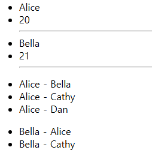
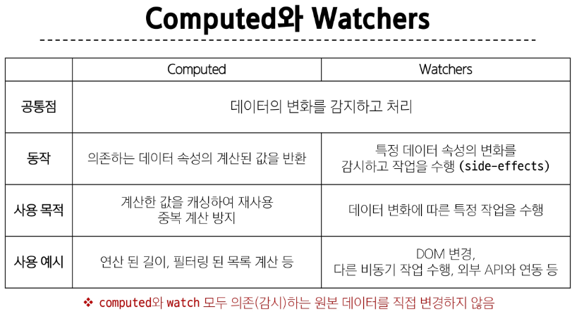

## Vue.js_vue 문법 2_computed, v-for, v-if, watcher
뷰 Day03
***
## computed properties
계산된 속성 : 미리 계산 -> 표현식 단순화 & 불필요한 반복 연산 줄이기  
`const { createApp, ref, computed }`로 선언  
```javascript
<p>{{ restOfTodos }}</p>
const todos = ref([
          { text: 'Vue 실습' },
          { text: '자격증 공부' },
          { text: 'TIL 작성' }
        ])

const restOfTodos = computed(() => { 
  return todos.value.length > 0 ? '아직 남았다.' : '퇴근!'
})
```
=> `todos`의 길이를 추적, todos
* 의존된 반응형 데이터를 자동 추적
* 의존하는 데이터가 변경될 때만 재평가
* 의존된 반응형 데이터를 기반으로 캐시(cached)  
= method로도 구현 가능 but, 렌더링 발생시 마다 함수 실행
```javascript
<p>{{ getRestOfTodos() }}</p>

const getRestOfTodos = function () {
  return todos.value.length > 0 ? '아직 남았다.' : '퇴근!'
}
```

### computed VS method
* 의존하는 데이터에 따라 결과가 바뀌는 계산된 속성을 만들 때 유용
* 동일한 의존성을 가진 여러 곳에서 사용할 때, 계산 결과 캐싱 -> 중복 계산 방지
* 읽기 전용 속성
* 의존된 데이터 변경 -> 자동 업데이트  
**  
* 단순히 특정 동작을 수행하는 함수 정의시 사용  
* 데이터에 의존 or X 상관없이 항상 동일한 결과 반환
* 호출해야지만 실행

### Cache 캐시
* 데이터, 결과를 일시적으로 저장해두는 임시 저장소
* 같은 데이터나 결과는 다시 계산 X -> 빠르게 접근 가능  
  ex) 과거 방문한 적 있는 페이지에 다시 접속
***
## conditional rendering 조건부 렌더링
1. `v-if` 표현식 값의 true/false에 따라, 요소를 렌더링
    ```javascript
    const isSeen = ref(true)
    <!-- if else -->
      <p v-if="isSeen">true일때 보여요</p>  // if 조건 만족할 때만 수행
      <p v-else>false일때 보여요</p>  // else에서 수행
      <button @click="isSeen = !isSeen">토글</button>
    ```
2. `v-else-if`
    ```javascript
    const name = ref('Cathy')
    <!-- else if -->
        <div v-if="name === 'Alice'">Alice입니다</div>
        <div v-else-if="name === 'Bella'">Bella입니다</div>
        <div v-else-if="name === 'Cathy'">Cathy입니다</div>
        <div v-else>아무도 아닙니다.</div>
    ```
3. template : 여러 요소에 적용   
  -> `<template> 문장 들 </template>` : 보이지 않는 wrapper  
  페이지 로드 시 렌더링 되진 않지만, JS를 활용해 나중에 문서에서 사용되도록 하는 메커니즘  

4. `v-show` : 표현식 값의 true/false로 가시성 전환   
* 항상 DOM에 렌더링 but, CSS의 display속성을 참/거짓으로 전환하는 것
  ```javascript
  <!-- v-show -->
  <div v-show="isShow">v-show</div>
  const isShow = ref(false)
  ```
5. v-if 와 v-show 사용처  
* `v-if` : 초기 로드 낮음, 토글 비용 높음, 실행 중 조건 변경 X
* `v-show` : 초기 조건에 관계 없이 항상 렌더링, 초기 렌더링 비용 높음, 자주 전환
***
## list rendering 리스트 렌더링
`v-for` : `alias in expression`형식의 특수 구문 사용  
(값, 키, 인덱스) 순서, 인덱스 또는 키에 대한 별칭 지정 가능
```javascript
<div v-for="item in myArr">
  {{ item.name }} / {{ item.age }}
</div> // Alice / 20 \n Bella / 21
<div v-for="(item, index) in myArr">
  {{ index }} / {{ item }}
</div> // 0 / { "name": "Alice", "age": 20 } \n 1 / { "name": "Bella", "age": 21 } 
<div v-for="(value, key, index) in myObj">
  {{ value }} / {{ key }} / {{ index }} 
</div>  // Cathy / name / 0 \n 30 / age / 1

const myArr = ref([
  { name: 'Alice', age: 20 },
  { name: 'Bella', age: 21 }
])
const myObj = ref({
  name: 'Cathy',
  age: 30
})
```
`template` : 마찬가지로, template 사용하여 여러 요소 반복 가능  
중첩된 반복문도 작성 가능
```javascript
<!-- v-for on <template> -->
<ul>
  <template v-for="item in myArr">
    <li>{{ item.name }}</li>
    <li>{{ item.age }}</li>
    <hr>
  </template>
</ul>

<!-- nested v-for -->
<ul v-for="item in myInfo">
  <li v-for="friend in item.friends">
    {{ item.name }} - {{ friend }}
  </li>
</ul>
const myInfo = ref([
  { name: 'Alice', age: 20, friends: ['Bella', 'Cathy', 'Dan'] },
  { name: 'Bella', age: 21, friends: ['Alice', 'Cathy'] }
])
```

***
### v-for와 key
내부 컴포넌트 상태를 일관되도록 함 -> 데이터의 예측 가능한 행동 유지  
key = 반드시 각 요소에 대한 **고유한 값을 나타낼 수 있는 식별자** 이어야 함  

"올바른 key 사용법"  
1. 권장되는 key 값
- 데이터베이스의 고유 ID
- 항목의 고유한 식별자
- 변경되지 않는 속성 값
- number, string으로만 사용

2. 피해야 할 사항
- 배열의 인덱스를 key로 사용하는 것
- 객체를 key로 사용하는 것  
```javascript
<div v-for="item in items" :key="item.id">
  {{ item.name }}
</div>
const { createApp, ref, computed } = Vue
const app = createApp({
  setup() {
    let id = 0

    const items = ref([
      { id: id++, name: 'Alice' },
      { id: id++, name: 'Bella' }
    ])

    return { items }
  }
})
```

### v-for와 v-if
동시에 사용 X -> 우선순위는 v-if가 높아 v-for 범위의 변수에 접근 불가  
* [해결]  
1. computed를 활용해 이미 필터링 된 목록을 반환하여 반복
2. template 요소를 사용하여 `v-for`와 `v-if`의 위치를 분리  
    ```javascript
    <div id="app">
    <!-- [Bad] v-for with v-if -->
    <!-- 동일 요소에 v-for와 v-if를 함께 사용하지 않는다. -->
    <!-- <ul>
      <li v-for="todo in todos" v-if="!todo.isComplete" :key="todo.id">
        {{ todo.name }}
      </li>
    </ul> -->

    <!-- [Good] computed 활용 -->
    <!-- 해결책 1. computed를 활용해 이미 필터링 된 목록을 반환하여 반복 -->
    <ul>
      <li v-for="todo in completeTodos" :key="todo.id">
        {{ todo.name }}
      </li>
    </ul>

    <!-- [Good] template 활용 -->
    <!-- 해결책 2. template 요소를 사용하여 v-for와 v-if의 위치를 분리 -->
    <ul>
      <template v-for="todo in todos" :key="todo.id">
        <li v-if="!todo.isComplete">
          {{ todo.name }}
        </li>
      </template>
    </ul>
    </div>

    <script src="https://unpkg.com/vue@3/dist/vue.global.js"></script>
    <script>
    const { createApp, ref, computed } = Vue

    const app = createApp({
      setup() {
        let id = 0

        const todos = ref([
          { id: id++, name: '복습', isComplete: true },
          { id: id++, name: '예습', isComplete: false },
          { id: id++, name: '저녁식사', isComplete: true },
          { id: id++, name: '노래방', isComplete: false }
        ])

        const completeTodos = computed(() => {
          return todos.value.filter((todo) => !todo.isComplete)
        })  // isCompleted가 false인 요소들을 computed 이용해서 모으기

        // console.log(completeTodos.value)

        return {
          todos,
          completeTodos
        }
      }
    })
    ```
***
## Watchers
`watch( )` : 하나 이상의 반응형 데이터 감시, 감시하는 데이터 변경시 **콜백 함수** 호출  
### watch 구조  
`watch(source, (newValue, oldValue) => { // 실행 문  })`
1. source : watch의 감시 대상 = 반응형 변수 , 값을 반환하는 함수
2. callback function : source 변경시 호출되는 콜백 함수  
* newValue는 대상의 변화된 값
* oldValue는 기존 값, optional  
### watch 예시
```javascript
<div id="app">
  <!-- 1 -->
  <button @click="count++">Add 1</button>
  <p>Count: {{ count }}</p>

  <!-- 2 -->
  <input v-model="message">
  <p>Message length: {{ messageLength }}</p>
</div>
const count = ref(0)
const message = ref('')
const messageLength = ref(0)
const myObj = ref({
  name: 'alice'
})

watch(count, (newValue, oldValue) => {
  console.log(newValue)   // 변경된 값 = 버튼을 누른 횟수 +된 값
  console.log(oldValue)   // 기존 값
})

watch(message, (newValue) => {
  messageLength.value = newValue.length   // 값 입력시 변경된 길이!
})
```
+) 여러 soucre를 감시 가능 by. 배열  
ex) `watch([foo, bar], ([newFoo, newBar], [preFoo, preBar]) => { 실행 문 })`  
+) `{deep : true}`를 통해 내부 깊이와 상관 없이 watch 가능
### Computed vs Watchers

***
## Lifecycle Hooks  
view 인스턴스, 컴포넌트의 생성부터 소멸까지 각 단계에서 실행되는 내부 함수  
[공식문서](https://vuejs.org/guide/essentials/lifecycle.html)  
### Lifecycle Hooks 예시
1. 초기 렌더링 및 DOM 요소 생성 완료 후 로직 수행 : `onMounted` 포함 -> `setup()`내의 `onMounted(() => { 실행 문 })`
2. `updating` : 반응형 데이터의 변경으로 인해 컴포넌트의 DOM이 업데이트 된 후 특정 로직 수행
***
### 참고_Vue Style Guide, computed, Lifecycle Hooks
#### Vue Style Guide
우선순위 4가지 : A(필수), B(적극권장), C(권장), D(주의 필요)
#### computed
computed의 반환 값 변경 X! = 읽기 전용, 일종의 snapshot  
배열 : reverse(), sort() 사용시 원본 배열의 변경 대신, 원본 배열의 복사본 만들기 `return [...numbers].reverse()`  
- `push(), pop)(), shift(), unshift(), splice(), sort(), reverse()` :  원본의 배열 변경
- `filter(), concat(), slice()` : 배열 교체, 원본 배열 수정 X  

```javascript
<!-- v-for와 배열을 활용해 “필터링/정렬” 활용하기 -->
<!-- 원본 데이터를 수정하거나 교체하지 않고 필터링하거나 정렬된 새로운 데이터를 표시하는 방법 -->
<div id="app">
<!-- 1. computed 활용 -->
<!-- 
  - 단순 배열의 필터링/정렬에 적합
  -->
<ul>
  <li v-for="number in evenNumbers">
    {{ number }}
  </li>
</ul>
<hr>
<!-- 2. method (computed가 불가능한 중첩된 v-for 경우) -->
<!-- 
  - 중첩된 v-for에서 사용
  - 매개변수가 필요한 경우 사용
-->
<ul v-for="numbers in numberSets">
  <li v-for="num in evenNumberSets(numbers)">
    {{ num }}
  </li>
</ul>
</div>
const numbers = ref([1, 2, 3, 4, 5])
const numberSets = ref([
  [1, 2, 3, 4, 5],
  [6, 7, 8, 9, 10]
])
// 1. computed를 사용한 짝수 필터링
const evenNumbers = computed(() => {
  return numbers.value.filter((number) => number % 2 === 0)
})
// 2. method를 사용한 짝수 필터링
const evenNumberSets = function (numbers) {
  return numbers.filter((number) => number % 2 === 0)
}
```

#### Lifecycle Hooks
1. 컴포넌트 상태의 일관성 유지 : 예측 가능하고 일관되게 유지되도록 작성, 비동기적 -> 버그 발생 가능 
2. vue내부 메커니즘과 동기화하기 : 비동기적으로 실행 X
***