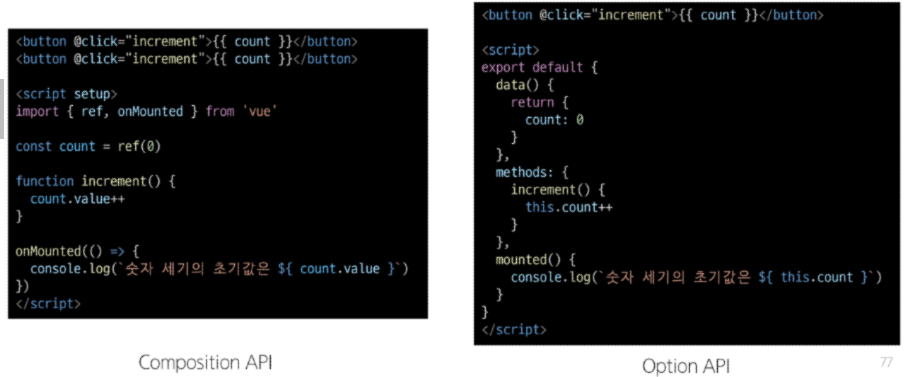

## Vue.js_vue single file component, vite, node.js
뷰 Day04
***
## SFC : single file components
component : 재사용 가능한 코드 블록  
single file components : 컴포넌트의 템플릿(HTML), 로직(JS) 및 스타일(CSS)을 하나의 파일로 묶어낸 특수한 파일 형식 (*.vue 파일 형태)  
.vue : `<template>` HTML, `<style>` CSS, `<script>` Javascript를 단일 파일로 합친 것

```vue
<template>
    <div>

    </div>
</template>

<script setup>

</script>

<style scoped>

</style>
```

### template
.vue 파일에서는 최상위 template 블록 한 개만 포함  

### script
* `<script setup>`도 한 개만 포함, 컴포넌트의 setup( ) 함수로 사용  
* 컴포넌트의 각 인스턴스에 대해 실행
* 변수 및 함수는 동일한 컴포넌트의 템플릿에서 자동 사용 가능

### style
* 여러 sytle태그 포함 가능
* scoped 지정시 CSS는 현재 컴포넌트에만 적용

***
## SFC build tool - Vite
### Vite 비트
프론트엔드 개발 도구, `비트`   
빠른 개발 환경을 위한 빌드 도구와 개발 서버 제공  
### Build
* 프로젝트의 소스 코드 최적화 & 번들링 -> 배포할 수 있는 형식으로 변환
* 개발 중에 사용되는 소스 파일, 리소스(JS, CSS, 이미지 파일 등)를 최적화된 형태로 조합하여 최종 소프트웨어 제품 생성  
0. windows에 node.js 설치, VS Code extention에 vue official, vue 3 snippets 설치
1. `npm create vue@latest` : vue project(application) 생성 = vite 기반 빌드  
2. `cd vue-project/` : 프로젝트 폴더로 이동
3. `npm install` : 패키지 설치
4. `npm run dev` :  Vue 프로젝트 서버 실행 -> `http://localhost:5173/`

***
## NPM : node package manager
* node.js 기본 패키지 관리자  
* node.js?! = Chrome의 V8 Javascript 엔진을 기반으로 하는 Server-Side 실행 환경  
  * 브라우저 내에서만 동작하던 JS  
  -> 서버 측에서도 실행 가능 = 백엔드와 프론트엔드가 같은 언어로 개발 가능해짐
  * NPM을 활용해 많은 오픈소스 패키지와 라이브러리 제공  
  -> 개발자들이 손쉽게 코드를 공유하고 재사용할 수 있도록 함

## 모듈 & 번들러
### Module 모듈 
: 프로그램을 구성하는 독립적인 코드 블록 (*.js파일)  
  * 애플리케이션의 크기 커지고 복잡해짐 -> 파일 여러개로 분리하여 관리
  * 모듈 = 분리된 각 파일,  (*.js)
  * but, 모듈 개수 증가 -> 병목 현상 발생, 모듈간의 의존성 증가 : 에러 해결 어려워짐  
  => bundler의 등장  
### bundler 번들러 
: 복잡하고 깊은 모듈 간의 의존성 문제 해결 도구  
=> 여러 모듈, 파일을 번들로 묶어 최적화, 애플리케이션에서 사용할 수 있도록 함
* 의존성 관리, 코드 최적화, 리소스 관리
* bundling = 번들러가 하는 작업
* vite는 rollup을 사용

***
## Vue Project 구조
### Node modules
* Node.js 프로젝트에서 사용되는 외부 패키지들이 저장되는 디렉토리
* 프로젝트의 의존성 모듈 저장 & 관리
* 프로젝트가 실행될 때 필요한 라이브러리와 패키지 포함 (like. `venv`)
* `.gitignore`에 작성
### package-lock.json
* 패키지 설치에 필요한 모든 정보 : 패키지의 설치 버전, 의존성 관계, 하위 패키지 등
* 패키지의 **정확한 버전** 보장 -> 협업시 공유하고 파일의 내용에 따라, 환경을 일치 시켜야 함
* `npm install`명령을 통해 패키지 설치 시, 명시된 버전과 의존성 기반으로 설치 
### package.json
* 프로젝트의 메타 정보, 의존성 패키지 목록 포함
* 프로젝트의 이름, 버전, 작성자, 라이선스와 같은 메타 정보 정의
### public
* 정적 파일 = 소스코드에서 참조 X, 항상 같은 이름, import 할 필요 없는 파일
* 항상 root 절대 경로를 사용하여 참조 `/파일명`
### src
프로젝트의 주요 소스코드 포함 : 컴포넌트, 스타일, 라우팅 등
#### src/assets
* 프로젝트 내에서 사용되는 자원 관리, ex) image, fonts, style sheets  
* 컴포넌트 자체에서 참조하는 내부 파일 저장
#### src/components
vue 컴포넌트들 작성   
#### src/App.vue
vue 앱의 최상위 Root컴포넌트, 다른 하위 컴포넌틀르 포함 하며 애플리케이션 전체의 레이아웃과 공통적인 요소 정의
#### src/main.js
* Vue 인스턴스 생성 & 애플리케이션 초기화  
* 필요한 라이브러리 import & 전역 설정 수행  
#### index.html
* vue앱의 기본 HTML 파일
* 앱의 진입점, root 컴포넌트인 `App.vue`가 mount됨 -> SPA방식  
* 외부 리스소가 필요한 경우 로드 ex) bootstrap CDN
#### config
기타 설정 파일  
* jsconfig.json : 컴파일 옵션, 모듈 시스템 설정
* vite.config.js : Vite 프로젝트 설정 파일, 플러그인, 빌드 옵션, 개발 서버 설정 등  
***
## Vue Component 활용
0. 초기 생성된 컴포넌트 삭제 (App.vue 제외), App.vue 코드 초기화  
1. 컴포넌트 파일 생성 -> `myComponet.vue` 생성
2. 컴포넌트 등록 = import -> `App.vue`에 등록  
    * template에 `<myComponent />`
    * `import myComponent from './components/myComponet.vue'` 
    * src/ = @/
3. myComponent의 자식 컴포턴트 myComponentItem 생성  

```javascript
// App.vue
<script setup>
import myComponent from '@/components/myComponent.vue'
</script>

<template>
  <h1> hello world </h1>
  <h1>App.vue</h1>
  <myComponent />
</template>
```
```javascript
// myComponent.vue
<script setup>
import myComponentItem from '@/components/myComponentItem.vue'
</script>

<template>
    <h2> MyComponent </h2>
    <myComponentItem />
    <myComponentItem />
    <myComponentItem />
</template>

<style scoped>

</style>
```
***
### virtual DOM
가상의 DOM을 메모리에 저장 & 변경된 부분만 실제 DOM에 동기화  
실제 DOM에 접근하지 않음! -> `querySelector, createElement, addEventListener` X  
  *  DOM관련 메서드 사용 대신 `ref( )`, `Lifecycle Hooks`함수 활용  
vue의 내부 렌더링 기술  
* 효율성 : 실제 DOM 동작 최소화, 변경된 부분만 업데이트 -> 성능 향상
* 반응성 : 데이터의 변경 감지 & 갱신하여 UI 자동 업데이트
* 추상화 : 실제 DOM 조작은 Vue에게 맡긴채로 컴포넌트와 템플릿을 활용하는 추상화된 프로그래밍 방식 
### Composition API & Option API
import를 활용해 컴포넌트에서 사용 : 직관적, Vue3  
vs  
`export default { 속성 값 }`활용해 컴포넌트 로직 정의 : Vue2에서 작성 방식  

***
### 참고_컴포넌트 작성 요령, CSS scoped, scaffolding
#### 컴포넌트 작성 요령
* 가독성, 스타일링, 명확한 컴포넌트 구조를 위해 각 컴포넌트에 최상단 HTML 요소 작성
* Single Rood Element 최상단 HTML 요소의 작성
#### CSS scoped
* style scoped 속성으로 부모 컴포넌트의 스타일 -> 자식 컴포넌트로 이동 X
* but, 자식 컴포넌트의 최상위 요소는 영향 O = 자식 컴포넌트의 최상위 요소인 `<div>`는 부모, 자식의 CSS 모두의 영향을 받음  
#### scaffolding 스캐폴딩
* 새로운 프로젝트, 모듈 사용을 위해 초기 구조, 기본 코드 자동 생성
* 개발자들이 프로젝트를 시작하는데 도움을 주는 틀, 기반 제공
* 초기 설정, 폴더 구조, 파일 템플릿, 기본 코드 자동 생성
***