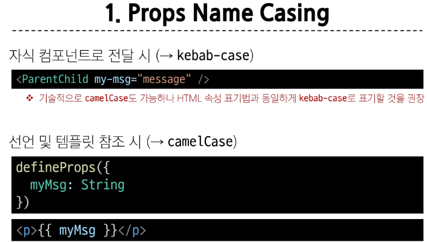
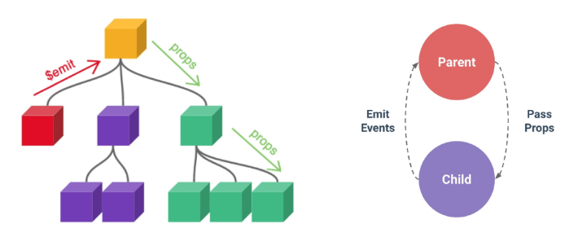

## Vue.js_vue Component State Flow, Emit & Props
뷰 Day05
***
## CSF 
### Passing Props
부모 컴포넌트로 부터 자식 컴포넌트들로 데이터를 전달하는데 사용되는 속성  
* 부모 속성 업데이트 -> 자식들으로 전달 : pass props
* 자식 속성 업데이트 -X> 부모 전달 X : emit event
* => 부모 컴포넌트에서만 변경 & 자식 컴포넌트는 자연스럽게 갱신
### Props 작성

props 사용을 위해 자식 컴포넌트에 명시적인 props 선언 필요  
부모 컴포넌트 측에 props의 이름과 값 작성  
Parent.vue에 template `<ParentChild my-msg='message' />` : props의 이름, props의 값 message   
한단계 더 내려보내기 : `<ParentGrandChild \n :my-msg="myMsg" /n />`
### Props 선언
ParentChild.vue의 script setup부분에 `defineProps( )`로 선언  
* 문자열 배열 : `defineProps( ['myMsg'] )`
* **객체** : `defineProps({ myMsg : String })`, 권장 방식   
props의 데이터 사용을 원하는 경우      
`const props = defineProps({ myMsg: String })`  
`console.log(props) // { myMsg: String }`  
`console.log(props.myMsg) // 'message'`  // prop라는 객체를 반환함 -> key로 값에 접근할 수 있음  
#### 예제
1. Parent.vue
    ```javascript
    // Parent.vue
    <template>
      <div>
        <ParentChild my-msg='message1'/>  // parent -> child로 my-msg라는 props 전달
      </div>
    </template>

    <script setup>
    import ParentChild from '@/components/ParentChild.vue';
    </script>
    ```
2. ParentChild.vue
    ```javascript
    // ParentChild.vue
    <template>
        <div>
          {{  myMsg }}        // 전달 받은 my-msg 출력!
          <ParentGrandChild   // child -> grandchild로 my-msg 전달 but, 이번엔 동적으로!
            :my-msg="myMsg"   // v-bind를 활용하여 javascript의 동적 변수 할당 가능
          />
        </div>
    </template>

    <script setup>
    import ParentGrandChild from '@/components/ParentGrandChild.vue';
    // props 선언 at. 자식 컴포넌트
    // 1. 문자열 배열 선언 방식
    // defineProps( ['myMsg'] )

    // 2. 객체 선언 방식 : 권장
    defineProps({             // 부모 컴포넌트로 부터 받은 props를 myMsg라는 변수에 저장
      myMsg : String 
    })
    </script>
    ```
3. ParentGrandChild.vue
    ```javascript
    // ParentGrandChild.vue
    <template>
      <div>
        <p>{{ myMsg }}</p>
      </div>
    </template>

    <script setup>
    defineProps({             // 부모 컴포넌트로 부터 받은 props를 myMsg라는 변수에 저장
      myMsg: String
    })
    </script>
    ```
### One-way Data Flow
하향식 단방향 바인딩 형성  
: 데이터 흐름의 일관성 및 단순화  
= 오류 발생 -> 위로 타고 올라가면서 디버깅 용이
### Static & Dynamic Props
v-bind를 활용한 동적으로 할당된 props 사용  
```javascript
// Parent.vue
<ParentChild 
  my-msg='message1'
  :dynamic-props="name"
/>
import { ref } from 'vue'
const name = ref('Alice')
```
```javascript
// ParentChild.vue
<p>{{ dynamicProps }}</p>
defineProps({ 
  myMsg : String,
  dynamicProps : String
})
```
***
### v-for 활용
데이터의 정의 & v-for 디렉티브의 반복 요소로 활용  
```javascript
// Parent.vue
<ParentItem
    v-for="item in items"
    :key="item.id"     // key 할당
    :my-prop="item"    // 동적으로 item 할당
/>
import ParentItem from '@/components/ParentItem.vue'
const items = ref([
  {id:1, name: '사과'},
  {id:2, name: '바나나'},
  {id:3, name: '딸기'}
])
```
```javascript
// ParentItem.vue
<template>
    <div>
        <p>{{ myProp.id}} </p>
        <p>{{ myProp.name}} </p>
    </div>
</template>

<script setup>
defineProps({
    myProp: Object
})
</script>
```
***
## Component Events : Emit

자식 컴포넌트에서 이벤트 발생 -> 부모 컴포넌트에 간접적으로 변경 요청    
`$emit( event, ...args )` : 자식 컴포넌트가 이벤트를 발생시켜 부모 컴포넌트로 데이터를 전달하는 역할의 메서드  
* event : 커스텀 이벤트 명 
* args : 추가 인자
* `$` : vue 인스턴스의 내부 변수

### 이벤트 발신 & 수신
1. `<button @click="$emit('someEvent')">클릭 : 자식 컴포넌트</button>`  
  : 자식 컴포넌트, 사용자 정의 이벤트 발신  
2. `@some-event="someCallback"`   
  : 부모 컴포넌트, `v-on` 활용해 수신
    ```javascript
    // Parent.vue
    <template>
    <div>
        <ParentChild 
        @some-event="someCallback"
        />  
    </div>
    </template>

    <script setup>
    import ParentChild from '@/components/ParentChild.vue';

    const someCallback = function () {
        console.log('자식컴포넌트에서 발생한 이벤트를 수신함.')
    }
    </script>
    ```
### Emit 이벤트 선언
`defineEmits( )` : 발신할 이벤트 선언 -> 배열, 객체의 두가지 방식  
javascript는 `$emit` 메서드에 접근 불가하므로 선언 방식이 다름  
```javascript
// ParentChild.vue
<button @click="buttonClick">클릭 : 자식 컴포넌트</button>
// emit 이벤트 선언  
// 1. 배열 방식
const emit = defineEmits(['someEvent', 'updateName'])

const buttonClick = function () {
    emit('someEvent')
}
```
### Emit 이벤트 인자 받아오기
```javascript
// ParentChild.vue
<button @click="emitArgs">추가인자 전달 : 자식 컴포넌트</button>
const emit = defineEmits(['emitArgs'])

const emitArgs = function() {
    emit('emitArgs', 1,2,3)
}
```
```javascript
// Parent`.vue
@emit-args="getNumbers"
const getNumbers = function(...args) {
    console.log(args)
}
```
***
#### Emit Events 실습
최하단 컴포넌트 ParentGrandChild에서 Parent 컴포넌트의 name 변수 변경 요청  
: ParentGrandChild -> ParentChild -> Parent 순으로 `emit`  
1. ParentGrandChild -> ParentChild
    ```javascript
    // ParentGrandChild.vue
    <template>
        <div>
            <button @click="updateName">이름 변경! : ParentGrandChild</button>
        </div>
    </template>
    <script setup>
    const emit = defineEmits(['updateName'])

    const updateName = function() {
        emit('updateName')
    }
    </script>
    ```
    ```javascript
    // ParentChild.vue
    <template>
      <div>
        <ParentGrandChild 
            :my-msg="myMsg" 
            @update-name="updateName"
        />
      </div>
    </template>    
    const emit = defineEmits(['updateName'])
    ```
2. ParentChild -> Parent
    ```javascript
    // ParentChild.vue
    <template>
        <div>
            <button @click="updateName">이름 변경! : ParentGrandChild</button>
        </div>
    </template>
    <script setup>
    const emit = defineEmits(['updateName'])

    const updateName = function() {
        emit('updateName')
    }
    </script>
    ```
    ```javascript
    // Parent.vue
    <template>
      <div>
        <ParentChild 
        @update-name="updateName"
        /> 
      </div>
    </template>    
    <script setup>
    const updateName = function (){
        name.value = 'Bella'
    }
    </script>
    ```
***
### 참고_컴포넌트 작성 요령, 정적vs동적 props
#### 컴포넌트 작성 요령
vue파일 내 변수명 작성시 주의사항..  
* JS 코드 작성시에는 camelCase
* HTML은 kebab-case

#### 정적vs동적 props
정적 props : `<SomeComponent num-props='1' />` = 문자열 '1' 전달  
동적 props : `<SomeComponent :num-props='1' />` = 숫자 1 전달
***